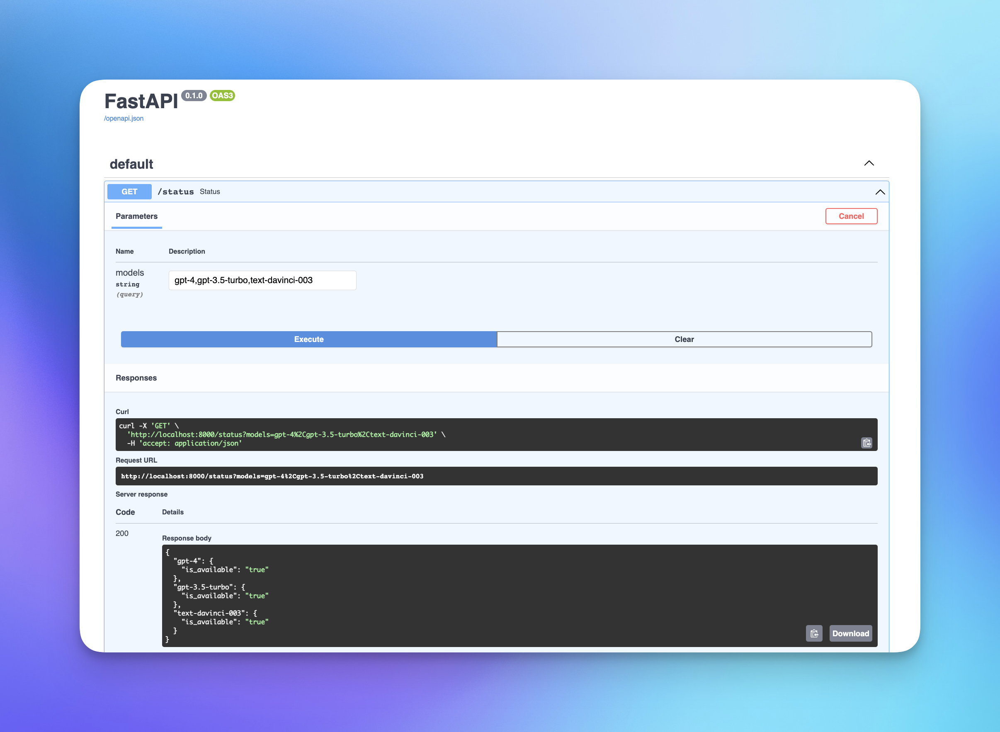

# OpenAI API Status Checker
Open Source FastAPI endpoint to ping OpenAI's servers to see the status of different models. This API checks the following endpoints:

```bash
gpt-4
gpt-3.5-turbo
text-davinci-003
```

It is easy enough to add in additional models, you will need to edit the ping_models.py file inside the app/services folder. Right now this implementation is very basic; you can host this API and call it on regular intervals (5 minutes) to check the status of the APIs. This will allow you to show your users a banner or notification that the APIs are down and to expect a delay in service.

## Getting Started

These instructions will help you set up the project and run it on your local machine for development and testing purposes.

### Prerequisites

Make sure you have the following software installed on your system:

- Python 3.8 or higher
- Pip (Python Package Installer)

### Installation

1. Clone this repository:

```bash
git clone https://github.com/aaronleggett96/openai-api-status-checker.git
cd openai-api-status-checker
```
2. Create a virtual environment and activate it:

```bash
python -m venv venv
source venv/bin/activate  # For Linux and macOS
# or
venv\Scripts\activate  # For Windows
```

3. Install the required packages:

```bash
pip install -r requirements.txt
```

4. Set up an environment variable for the OpenAI API key:

```bash
export OPENAI_API_KEY=your_openai_api_key  # For Linux and macOS
# or
set OPENAI_API_KEY=your_openai_api_key  # For Windows
```

Replace your_openai_api_key with your actual OpenAI API key.

5. Running the Application

Start the development server:

```bash
uvicorn app.main:app --reload
```

The application should now be running on http://localhost:8000/.

### Usage
To check the availability of OpenAI's APIs, send a GET request to the /status endpoint with the desired model names as a comma-separated list in the models query parameter. You can search for one at a time, or multiple.

### Example:

```bash
http://localhost:8000/status?models=gpt-4,gpt-3.5-turbo,text-davinci-003
```
The response will be a JSON object containing the availability status of the requested models:

```json
{
  "gpt-4": {
    "is_available": "true"
  },
  "gpt-3.5-turbo": {
    "is_available": "true"
  },
  "text-davinci-003": {
    "is_available": "true"
  }
}
```

Additionally, FastAPI comes with SwaggerUI out-of-the-box. You can access this via the /docs endpoint:

```bash
http://localhost:8000/docs
```



### License
This project is licensed under the MIT License - see the [LICENSE](LICENSE.md) file for details.

#### Fun Fact: I wrote virtually zero of this code, I just got annoyed when I saw someone trying to charge $10pm for it on Twitter. Thanks, GPT-4!
